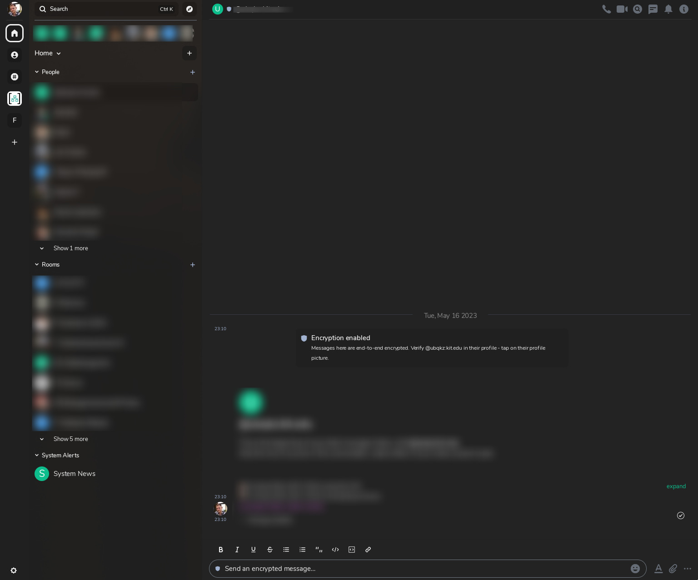

# Element oneDark Theme

This is a theme for the popular Matrix-Client [Element](https://element.io/).\
If you have anything to add to this please open a new [Issue](https://github.com/Chr1s70ph/element_onedark_theme/issues/new)

## Installation

- Head to the theme settings
  - Settings -> Appearance
- Paste `https://raw.githubusercontent.com/Chr1s70ph/element_onedark_theme/master/oneDark.json` 
in the **`custom theme URL`** field.

## Preview

